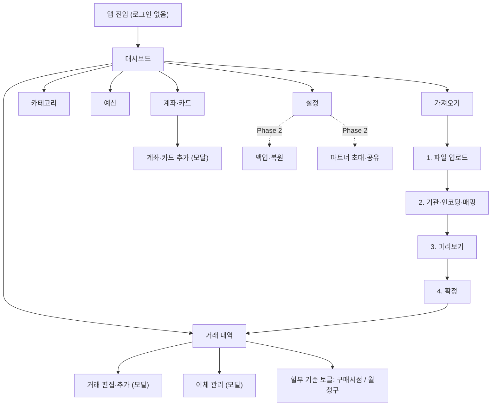

# 정보구조(IA) · 내비게이션 맵

| 항목 | 내용 |
| :-- | :-- |
| 문서 버전 | v0.1 (초안) |
| 작성일 | 2026-07-08 |
| 담당 | ui-ux-designer |
| 근거 | 요구사항 v1.0 + 델타, ADR-0007/0008(로컬 우선·무인증), UI 목업 |

앱의 화면 구조와 이동 경로. **로컬 우선·무인증**이라 진입 즉시 대시보드로 간다(로그인 없음). 백업·파트너 초대 등 서버 기능은 화면에 **Phase 2로 표시만** 한다.

## 내비게이션 맵

## 플랫폼별 내비게이션

- **데스크톱/웹**: 좌측 사이드바(대시보드·거래·가져오기·카테고리·예산·계좌카드·설정).
- **모바일**: 하단 탭 5개(대시보드·거래·가져오기·계좌카드·더보기) + '더보기'에 카테고리·예산·설정. (모바일 반응형은 후속 설계)

## 화면 인벤토리

| 화면 | 목적 | 주요 요소 | FR | Phase |
| :-- | :-- | :-- | :-- | :-- |
| 대시보드 | 이번 달 합산 요약 | 수입/지출/순액, 공동·개인 분담, 카테고리·추이, 계좌 잔액, 이체 제외 안내 | FR-DB, FR-SH-02, FR-AC-04 | 1 |
| 거래 내역 | 전체 거래 조회·관리 | 검색·필터, 이체 세그먼트, 할부 토글, 편집/추가, 이체 관리 | FR-TX, FR-AC-04, FR-TX-04 | 1 |
| 가져오기 | 파일 import | 4단계(업로드→인식·매핑→미리보기→확정) | FR-IM, FR-AC-04 | 1 |
| 카테고리 | 분류·자동규칙 | 기본/사용자정의, 키워드 규칙 | FR-CT | 1 |
| 예산 | 예산 대비 실적 | 카테고리별 소진율·초과 | FR-BG | 1 |
| 계좌·카드 | 계좌·카드 관리 | 잔액, 카드↔결제계좌, 돈의 흐름 | FR-AC-01~03 | 1 |
| 설정 | 앱 설정 | 카테고리 기본값 등 · (백업·초대는 Phase 2) | — | 1/2 |

## 상태(State) 정책 (모든 목록·요약 화면)

- **빈 상태**: 데이터 없을 때 "내역 가져오기" 유도(대시보드·거래).
- **로딩**: import 파싱 등 시간이 걸리는 작업에 진행 표시.
- **에러**: 파싱 실패·형식 오류는 사유와 함께 표시, 정상 행은 계속(FR-IM).

### 변경 이력
- **v0.1 (2026-07-08)**: 최초. 내비게이션 맵·화면 인벤토리·상태 정책(로컬 우선 반영).
