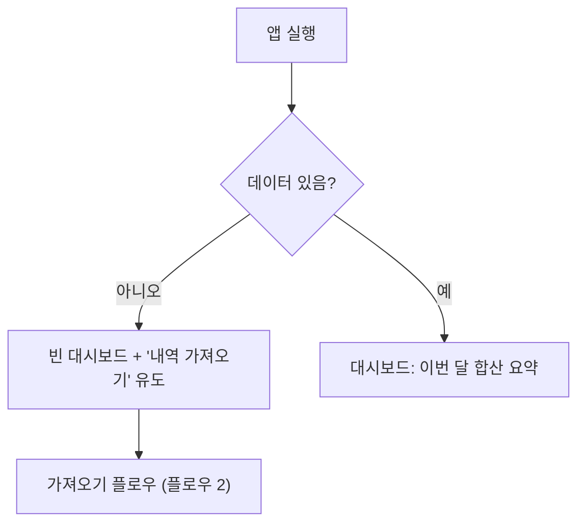
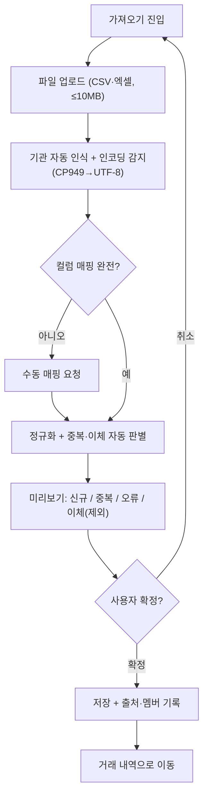
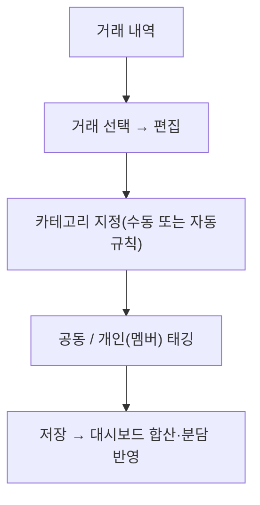
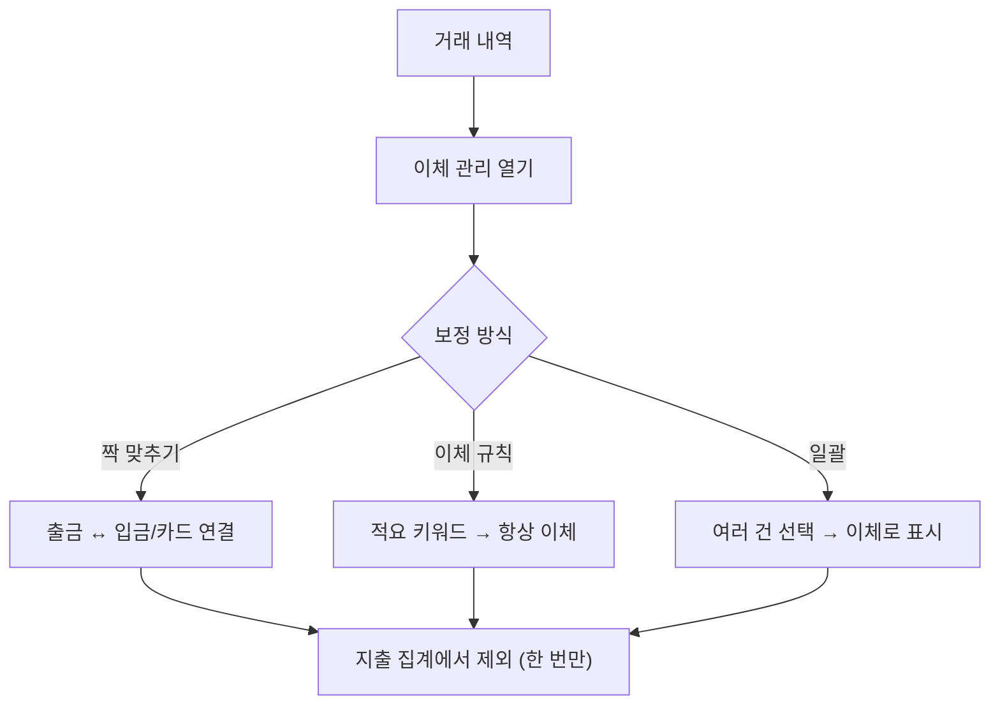
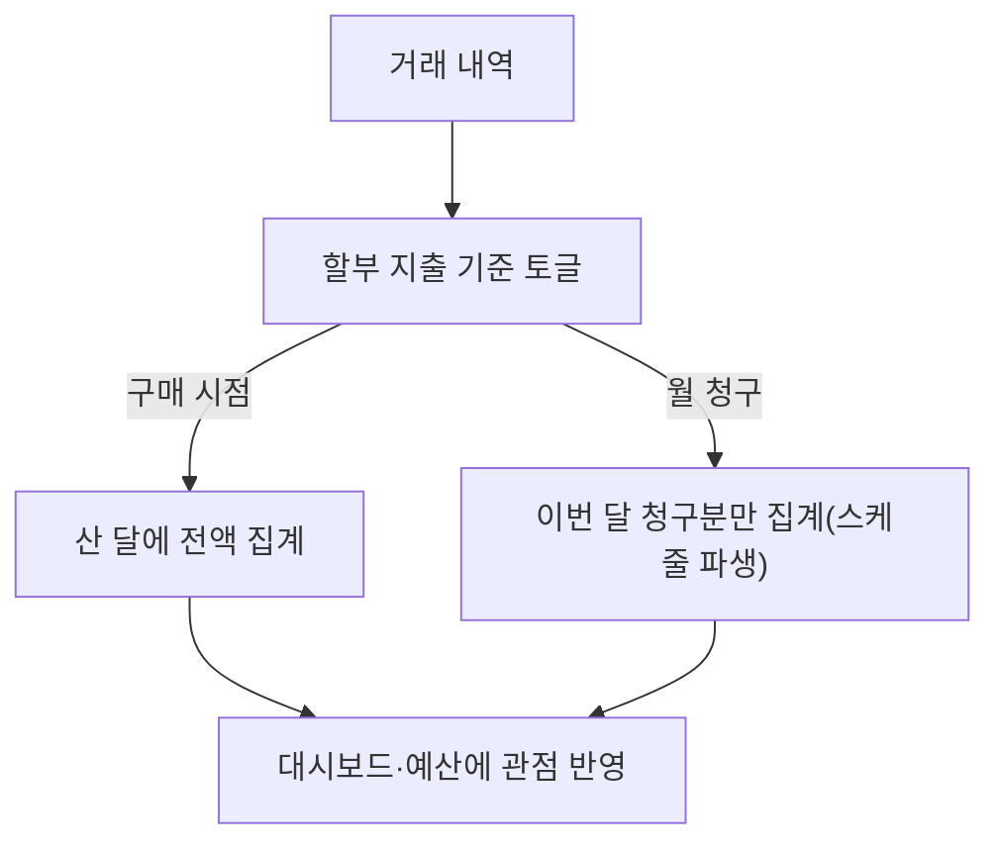
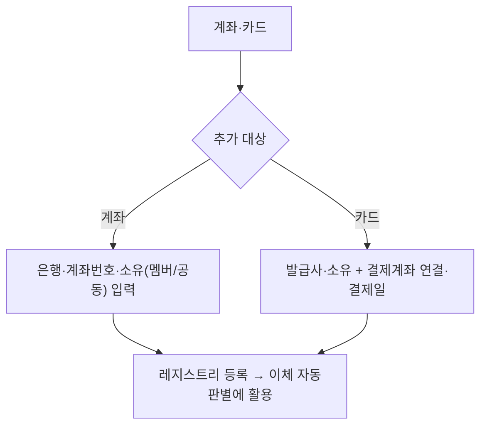
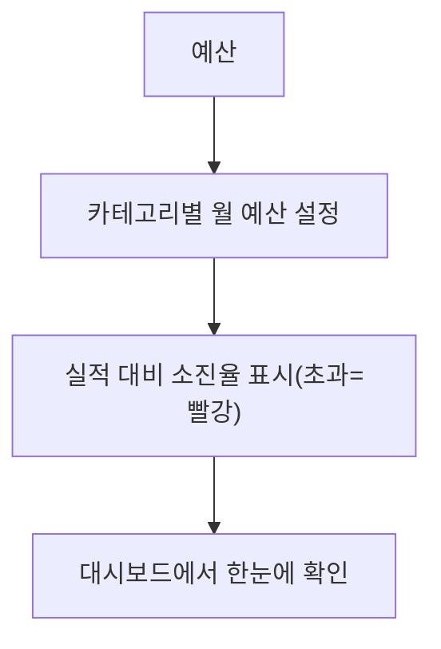
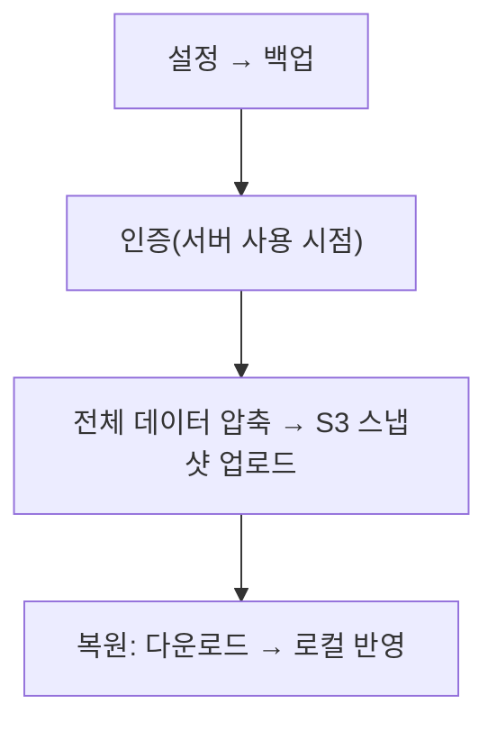

# 유저 플로우 (User Flows)

| 항목 | 내용 |
| :-- | :-- |
| 문서 버전 | v0.1 (초안) |
| 작성일 | 2026-07-08 |
| 담당 | ui-ux-designer |
| 근거 | 요구사항 v1.0 + 델타, ADR-0004~0008, IA(`information-architecture.md`) |

핵심 시나리오의 흐름. 로컬 우선·무인증 전제(진입 즉시 사용).

## 1. 첫 진입 (빈 상태 → import 유도)

## 2. 가져오기 (Import) — 제품의 심장

## 3. 거래 분류·태깅 (카테고리 + 공동/개인)

## 4. 이체 — 이중집계 방지 (수동 보정)

## 5. 카드 할부 — 보기 전환

## 6. 계좌·카드 등록

## 7. 예산 설정·점검

## 8. 백업 (Phase 2)

### 변경 이력
- **v0.1 (2026-07-08)**: 최초. 8개 핵심 플로우(진입·import·분류·이체·할부·계좌카드·예산·백업).
