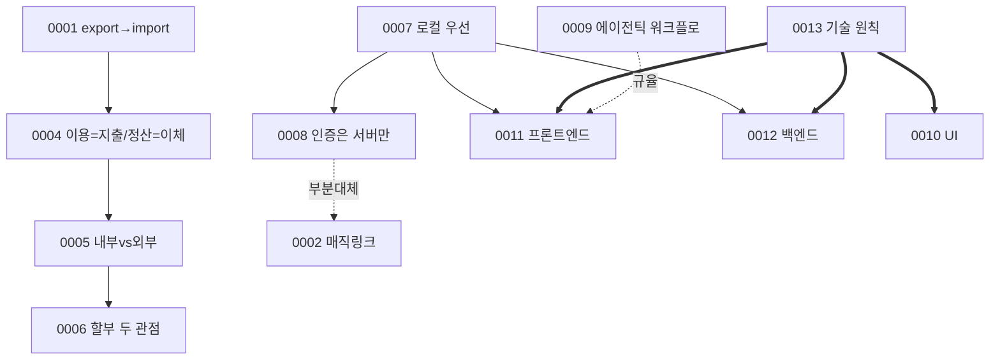

# ADR (결정 기록) — 구조 안내

결정은 **카테고리 폴더**로 나눠 둔다. 폴더 트리만 봐도 "어떤 성격의 결정이 어디에 있는지"를 사람이 바로 검증할 수 있다. 각 `adr-XXXX-*.md`가 정본이고, 이 문서는 폴더 안내 + 관계도(폴더로는 표현 못 하는 부분)만 담는다.

## 폴더 = 카테고리

| 폴더 | 성격 (어디에/누가) | 들어있는 결정 |
| :-- | :-- | :-- |
| `01-product-and-data/` | 제품·데이터 수집 (import·spec) | 0001 자동연동 미사용 |
| `02-finance-logic/` | 가계부 핵심 계산 로직 (frontend·집계) | 0004 이용=지출/정산=이체 · 0005 내부vs외부 이체 · 0006 할부 두 관점 |
| `03-architecture-and-auth/` | 아키텍처·인증 (all·backend) | 0007 로컬 우선+S3백업 · 0008 인증은 서버만 · 0002 매직링크(⚠️ 부분대체) |
| `04-tech-stack/` | 기술 스택 (frontend·backend) | 0013 선택 원칙 · 0010 UI · 0011 프론트 · 0012 백엔드 |
| `05-process-and-docs/` | 개발 방식·문서 (all agents·product-owner) | 0003 문서 구조 · 0009 에이전틱 워크플로 |

> 번호(0001…)는 시간순, 폴더는 성격. 파일명이 번호를 유지하므로 연대기와 분류를 동시에 본다.

## 관계도 (폴더로는 안 보이는 부분)

`→` 파생 · `==>` 상위 원칙이 규율 · `-. 대체/규율 .->` 관계.

## 새 ADR 추가 규칙

1. 성격에 맞는 카테고리 폴더에 `adr-XXXX-kebab.md`(다음 번호)로 만든다. 새 카테고리가 필요하면 `0N-이름/` 폴더를 추가.
2. 형식: 상태·날짜·단계 / 맥락 / 결정 / 근거 / 결과 / 관련.
3. 기존 결정을 바꾸면 옛 ADR **상태 갱신**(대체/부분대체) + 관계 명시. 필요 시 위 관계도 갱신.
